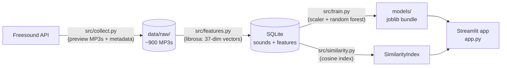

# 🎧 AudioDNA

**A game sound-effect classifier and similarity search engine**, built as a
data science portfolio project. Upload a sound → see its spectrogram, get a
predicted category, and find the 5 most similar sounds in a library of ~900
Creative Commons game SFX from [Freesound.org](https://freesound.org).

> 📸 *Screenshots coming soon — `reports/screenshots/`*

## How it works



1. **Collect** (`src/collect.py`) — for each of 6 categories (`impact`,
   `footsteps`, `ambience`, `ui`, `explosion`, `weapon`), search the
   Freesound text API and download ~150 short preview MP3s with full
   metadata (license, uploader). Throttled, idempotent, resumable.
2. **Extract** (`src/features.py`) — load each file mono at 22 050 Hz, trim
   silence, and compute a 37-dimensional feature vector: mean + std of
   13 MFCCs (timbre), spectral centroid/bandwidth/rolloff, zero-crossing
   rate, RMS energy, plus duration. Stored as JSON in SQLite.
3. **Explore** (`notebooks/01_eda.ipynb`) — class balance, durations,
   waveforms + mel spectrograms per category, feature boxplots, and a PCA
   projection that correctly predicts which classes the model will confuse.
4. **Train** (`src/train.py`) — stratified 80/20 split, scaler fit on train
   only; logistic-regression baseline vs. grid-searched random forest.
5. **Search** (`src/similarity.py`) — standardized, unit-normalized feature
   vectors; top-k cosine similarity is one matrix-vector product.
6. **Serve** (`app.py`) — Streamlit app: upload → spectrogram → prediction
   with class probabilities → 5 nearest sounds with playback and
   attribution; plus a library browser tab.

## Results

| model | test accuracy |
|---|---|
| chance (6 balanced classes) | 16.7% |
| logistic regression (baseline) | 62.2% |
| **random forest (200 trees, grid-searched)** | **77.2%** |

Per-class F1 (test set): ambience .81 · ui .80 · explosion .78 ·
footsteps .77 · weapon .77 · impact .71.

The confusion matrix ([reports/confusion_matrix.png](reports/confusion_matrix.png))
matches acoustic intuition: the percussive trio **impact / weapon /
explosion** accounts for most errors — a sword hit *is* an impact, and a
gunshot is acoustically a small explosion. Full metrics in
[reports/metrics.txt](reports/metrics.txt).

## Setup

Requires Python 3.10+ and a free [Freesound API key](https://freesound.org/apiv2/apply/).

```bash
git clone <this-repo> && cd audiodna
python -m venv .venv
.venv\Scripts\activate          # Windows  (Linux/macOS: source .venv/bin/activate)
pip install -r requirements.txt
copy .env.example .env          # then paste your Freesound API key into .env
python check_setup.py           # sanity check: should print 4x [OK]
```

## Run the pipeline

```bash
python -m src.collect --all     # ~25 min (rate-limited), ~60 MB of audio
python -m src.features          # ~1 min
python -m src.train             # ~15 s; writes reports/ and models/
python -m src.similarity        # CLI demo: random sound + 5 neighbors
streamlit run app.py            # the app
```

Every script is idempotent — re-running skips work already done, so an
interrupted collection just resumes.

## Tests

```bash
python -m pytest tests
```

Tests use synthetic signals (sine waves, noise) and a hand-built similarity
index, so they pass on a fresh clone with no data downloaded — and they
verify the features *mean* what they claim (a 4 kHz tone must have a higher
spectral centroid than a 200 Hz tone, noise must have wider bandwidth than
a pure tone, near-duplicates must out-rank outliers).

## Data licensing & attribution

All audio comes from [Freesound.org](https://freesound.org) under Creative
Commons licenses (CC0, CC BY, CC BY-NC, ...). The audio itself is **not
redistributed in this repository** — `data/raw/` is gitignored and each
user collects their own copy via the API. The app displays full attribution
(title, uploader, license, link to the Freesound page) for every sound it
plays, as the licenses require. If you fork this project, keep the
attribution display intact.

## What I learned

- **Audio DSP from scratch**: what MFCCs, spectral centroid/bandwidth/
  rolloff, and zero-crossing rate actually measure, and how mean+std
  pooling turns variable-length audio into fixed-length vectors.
- **Leakage discipline**: the scaler is fit on the training split only, and
  hyperparameters are chosen by cross-validation that never touches the
  test set.
- **Weak labels have a ceiling**: categories come from search queries, not
  human annotation — some "weapon" sounds are literally impacts. The
  confusion matrix reflects the *label* overlap as much as model error.
- **Train/serve consistency**: the app runs the exact same feature code and
  scaler as training (one shared function, one persisted bundle), because
  a silently different serving pipeline is the classic way ML demos break.

## Future work

- Delta-MFCCs and percentile pooling (richer temporal dynamics).
- Human relabeling pass on the percussive classes, or multi-label targets.
- Try a small CNN on mel spectrograms and compare against the
  feature-based forest.
- Approximate nearest neighbors (e.g. `hnswlib`) if the library grows
  beyond what brute-force cosine handles comfortably.

## Deployment (Streamlit Community Cloud)

The repo deliberately contains no audio, database, or model binaries, so
the deployed app bootstraps itself from a small **demo bundle** — 72 CC0
(public-domain) sounds (12 per category) plus the trained model, ~8 MB —
hosted as a GitHub Release asset and downloaded on first boot.

1. Build the bundle locally (requires the full pipeline to have run):

   ```bash
   python -m scripts.make_demo_bundle      # writes demo_bundle.zip
   ```

2. Push this repo to GitHub, then create a release and attach the zip:

   ```bash
   gh release create v1.0 demo_bundle.zip --title "AudioDNA demo bundle"
   ```

3. On [share.streamlit.io](https://share.streamlit.io), deploy the repo
   with `app.py` as the entry point.

4. In the app's **Settings → Secrets**, add the asset's download URL:

   ```toml
   DEMO_BUNDLE_URL = "https://github.com/<you>/<repo>/releases/download/v1.0/demo_bundle.zip"
   ```

On boot, `ensure_demo_data()` in `app.py` sees the data is missing,
downloads the bundle (a few seconds), and unpacks it. Locally this is a
no-op because your full dataset is already in place. Note the demo
deployment classifies uploads with the full-dataset model — only the
*similarity library* is reduced to 72 sounds.

